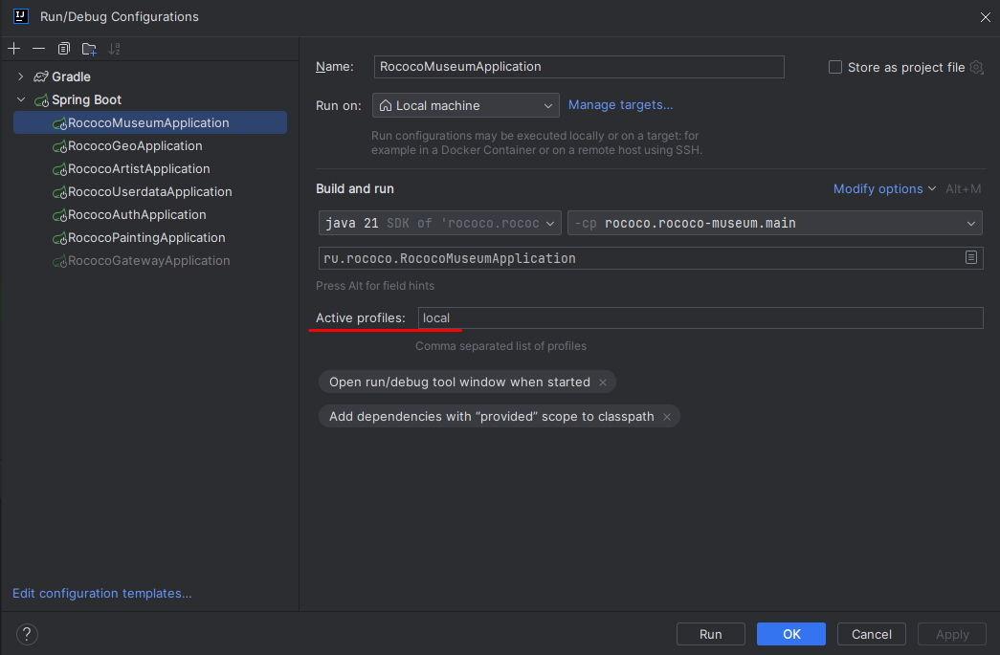

# Rococo

# Описание проекта

# Запуск проекта

### 1. Запустить фронт

Выполнить команды:

```
cd rococo-client
npm i
npm run dev
```

Адрес фронта: http://127.0.0.1:3000/

### 2. Поднять базу данных и кафку

#### 2.1. Спуллить контейнеры:

```
docker pull postgres:15.1
docker pull confluentinc/cp-zookeeper:7.3.2
docker pull confluentinc/cp-kafka:7.3.2
```

#### 2.2. Создать volume для сохранения данных БД на локальном компьютере:

```
docker volume create pgdata
```

#### 2.3. Запустить БД, zookeeper и kafka:

```
bash localenv.sh
```

#### 2.4. Создать базы данных:

```
bash init-database.sh
```

**Для Windows:**

При ошибке связанной с переносом строк, нужно выполнить команду:

```
sed -i -e 's/\r$//' init-database.sh
```

При ошибке `No such file or directory`:

```
chmod +x init-database.sh
```

Нужно проверить что БД создались. Если по какой-либо причине это не произошло, можно создать базы
`rococo-artist`, `rococo-auth`, `rococo-geo`, `rococo-museum`, `rococo-painting` `rococo-userdata` руками

### 3. Запустить сервисы:

Для всех сервисов нужно выставить в Edit Configurations профиль `local`


# Тесты

Тесты находятся в модуле `rococo-e2e-tests`
